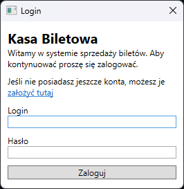

# Kasa biletowa

## Opis

Program symuluje działanie kasy biletowej. Użytkownik może wybrać dzień odjazdu, stację początkową i końcową.
Program korzysta z pliku stations.json zawierającego stacje w formacie:

```json
[
  {
    "id": 16592,
    "name": "Wierzchucin",
    "name_slug": "wierzchucin",
    "latitude": 53.5481705080276,
    "longitude": 18.1123450777675,
    "hits": 3245,
    "ibnr": 239,
    "city": "Wierzchucin",
    "region": "kujawsko-pomorskie",
    "country": "Polska",
    "localised_name": null,
    "is_group": false,
    "has_announcements": false
  }
]
```
Przykładowy plik stations.json znajduje się w repozytorium.

   
